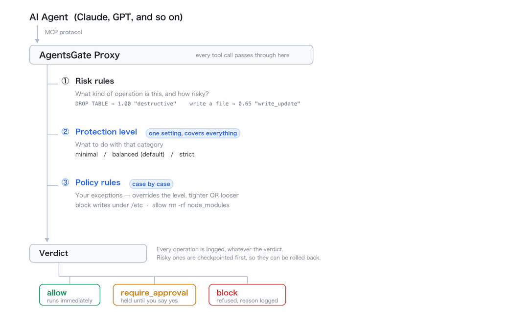

# AgentsGate

[](https://github.com/agentsgate/agentsgate/actions/workflows/ci.yml)
[](https://www.npmjs.com/package/agentsgate)
[](https://nodejs.org)
[](LICENSE)

**AI Agent I/O Tracking & Rollback System — MCP Proxy Gateway**

> **Status: 0.1.3.** The proxy, risk scoring, checkpoints and rollback are
> covered by 7,428 tests, but the API surface should be treated as unstable
> until 1.0 — command flags and config keys may still change. Read
> [SECURITY.md](SECURITY.md) before exposing anything beyond loopback, and
> `agentsgate level` before assuming what the defaults stop.

AgentsGate sits between AI agents (Claude, GPT, etc.) and the MCP tools they call. Every tool call is intercepted, risk-scored, checkpointed, and optionally paused for human approval before execution. If an agent does something destructive, you can roll back in seconds.



Two stages decide the verdict. The **protection level** is one broad setting
covering every kind of operation — `agentsgate level` shows what it stops.
**Policy rules** are your exceptions on top, and can tighten or loosen it.
Everything is logged either way, and anything risky is checkpointed first so it
can be rolled back.

---

## Security model — read this first

AgentsGate is a **local, single-operator tool**. It records everything your agent
does, including tool arguments and results that routinely contain file contents,
database rows, and credentials.

**The proxy transport has no authentication, and the dashboard's is opt-in.**
That is safe only because AgentsGate binds to loopback by default:

| Surface | Default port | Default bind | Built-in auth |
|---------|--------------|--------------|---------------|
| MCP proxy | `4000` | `127.0.0.1` | **None** |
| Dashboard REST/SSE | `4001` | `127.0.0.1` | Opt-in (`dashboard.apiKey`) |

`proxy.host` controls the bind address for the proxy, dashboard, and WebSocket
gateway. Leave it at `127.0.0.1` unless you know exactly what you are doing.

> **If you set `proxy.host` to a routable address, you must put an
> authenticating reverse proxy in front of it.** No AgentsGate setting alone
> makes a non-loopback bind safe — exposing it without a reverse proxy means
> unauthenticated operation forwarding plus full read access to your agent's
> history. AgentsGate prints a startup warning when you do this; treat it as an
> error in production.

For the full threat model, residual risks, and a deployment checklist, see
[SECURITY.md](SECURITY.md).

---

## Features

**Proxy & Interception**
- Zero-trust MCP proxy — every tool call intercepted regardless of agent cooperation
- Stdio transport support (`MCPStdioProxy`) for pipe-based MCP clients
- Dry-run mode (`--dry-run`) — scores and logs without blocking any operations
- Per-operation session tracking, agent identification, and tag propagation

**Risk Scoring**
- L1 static rules — 8 built-in rules covering destructive file ops, sensitive path writes, database drops, command execution, git force-push
- L2 user history — per-agent Bayesian model (requires ≥10 outcomes)
- L3 community enrichment — configurable HTTP endpoint (opt-in)

**Checkpoints & Rollback**
- Pre-operation file snapshots into a shadow git repository
- One-command rollback to any checkpoint
- Checkpoint diff view before restoring
- Rollback preview (dry-run before committing restore)

**Policy System** (see [docs/policy-guide.md](docs/policy-guide.md))
- Custom policy rules loaded from `~/.agentsgate/policy.json`
- Per-rule match on tool, method, agentId, pathPattern, params, and tags —
  exact strings, or `/regex/flags`
- Rule actions: `allow`, `block`, `require_approval`, or score override
- Agent allowlist / denylist
- Per-agent tool allowlist / denylist
- L1 rule muting and score overrides
- Hot reload with `--policy=path`; a file that does not parse is ignored and the
  running policy stays in force
- Presets — `agentsgate policy preset apply strict|permissive|readonly`
- Live policy stats via the dashboard

**Approval Queue**
- Operations are held at the stdio proxy until approved or denied — the tool is
  not called before someone answers, and no answer is a denial
- On the HTTP proxy, approval leaves a one-time grant the agent's retry spends;
  `approvals.holdHttpRequests` makes it wait instead
- Webhook notifications (with retry) on enqueue
- Slack Incoming Webhook integration
- Escalation webhooks for stale approvals
- Approvals persist across restarts (SQLite-backed)
- Auto-expiry with configurable TTL (default 24h)
- Real-time SSE push when approvals expire

**Dashboard API** (see [docs/api-reference.md](docs/api-reference.md))
- Full REST API: operations, agents, tools, sessions, risk, checkpoints, rollback, approvals, policy, telemetry, circuit breakers, rate limits, quota, audit
- Server-Sent Events (`GET /events`) for live operation feed
- Prometheus metrics (`GET /metrics`)
- RBAC via `X-API-Key` header
- Audit log HMAC-SHA256 verification (`GET /audit/verify`)
- CSV export for operations

**Telemetry & Analytics**
- Anonymized aggregate stats — zero PII stored
- Anomaly detection with z-score alerting (configurable threshold)
- Periodic export to a configurable HTTP endpoint
- Per-agent, per-tool, per-session telemetry breakdowns

**Plugin Adapters**
- `BaseRollbackAdapter` base class for extending rollback to SaaS tools
- Community adapter registry — load adapters from a directory

**Operations Management**
- Per-agent and per-tool operation history
- Full-text and filter-based search across operations
- Rate limiting per agent (ops/minute)
- Circuit breaker per agent
- Daily quota management per agent
- Log retention and pruning

**Developer / Ops Tools**
- `agentsgate doctor` — environment health check
- `agentsgate benchmark` — throughput benchmark
- `agentsgate inject` / `eject` — auto-configure Claude Desktop
- `agentsgate completion` — shell autocomplete

---

## Installation

```bash
npm install -g agentsgate
```

Or run directly without installing:

```bash
npx agentsgate start
```

For local development from a fresh clone:

```bash
git clone https://github.com/agentsgate/agentsgate.git
cd agentsgate
npm run bootstrap
```

---

## Quick Start

```bash
# Start the proxy (default port 4000, dashboard on port 4001)
agentsgate start

# Start on a custom port
agentsgate start 8080

# Check that the proxy is running
agentsgate status

# Show effective config
agentsgate config

# Show dashboard health
agentsgate health
```

### Configure Claude Desktop

```bash
# Auto-inject AgentsGate into Claude Desktop's MCP config
agentsgate inject

# Verify injection
agentsgate status

# Remove injection
agentsgate eject
```

Restart Claude Desktop after injection. All Claude tool calls now flow through AgentsGate.

---

## CLI Reference

See **[docs/cli.md](docs/cli.md)** for every command and flag, grouped by
category. The most common ones:

| Command | Description |
|---------|-------------|
| `agentsgate start [port]` | Start the proxy and dashboard |
| `agentsgate stop` | Stop the running proxy |
| `agentsgate status` | Show proxy PID, port, dashboard URL, and start time |
| `agentsgate doctor` | Self-check config, database, shadow repo, and injection |
| `agentsgate inject` | Register AgentsGate in Claude Desktop's MCP config |
| `agentsgate ops tail [--limit=N]` | Tail recent operations |
| `agentsgate approvals` | List operations waiting for approval |
| `agentsgate rollback <checkpointId>` | Roll back to a checkpoint |
| `agentsgate --version` | Print the version |

---

## Dashboard API

While the proxy is running, a REST server on `port+1` (default: 4001) provides full visibility and control. See **[docs/api-reference.md](docs/api-reference.md)** for the complete endpoint reference.

Key features:
- All endpoints (except `GET /health`) require `X-API-Key` header when `dashboard.apiKey` is set
- Real-time events via `GET /events` (Server-Sent Events)
- Prometheus metrics via `GET /metrics`
- CSV export via `GET /operations/export`
- Rollback via `POST /rollback/:checkpointId`
- Approval management via `POST /approvals/:id/approve` and `POST /approvals/:id/deny`

---

## Risk Scoring

Operations are scored 0.0 (safe) → 1.0 (extremely risky) using three layers:

| Layer | Source | Status |
|-------|--------|--------|
| L1 Static rules | Built-in rule set | Always active |
| L2 User history | Per-agent Bayesian model | Active (requires ≥10 outcomes) |
| L3 Community | Configurable HTTP enrichment | Opt-in via `intelligence.communityEndpoint` |

### L1 Rules

Thirty rules ship built in. A representative sample follows —
`agentsgate policy list` prints them all, and
[docs/policy-guide.md](docs/policy-guide.md) covers muting and re-scoring them.

| Rule ID | Trigger | Default Score |
|---------|---------|---------------|
| `L1_DELETE_FILE` | `delete_file`, `unlink`, `rm` on filesystem tools | 0.90 |
| `L1_SENSITIVE_PATH_WRITE` | Write to `.env`, `.ssh/`, `.aws/`, `credentials`, etc. | 0.90 |
| `L1_DROP_TABLE` | `drop`/`truncate` on non-filesystem tools | 0.95 |
| `L1_DELETE_RECORD` | `delete`/`remove` on non-filesystem tools | 0.75 |
| `L1_EXECUTE_COMMAND` | `execute`, `exec`, `shell`, `spawn` | 0.80 |
| `L1_GIT_FORCE_PUSH` | `force`/`reset`/`rebase` on github/git tools | 0.85 |
| `L1_OVERWRITE_FILE` | `write_file`, `overwrite`, `create` on filesystem | 0.65 |
| `L1_READ_ONLY` | `read_*`, `list_*`, `get_*`, `describe_*`, etc. | 0.05 |
| `L1_SENSITIVE_FILE_TYPE` | Write to `.pem`, `.key`, `.env`, `.crt` | 0.75 |
| `L1_DB_DROP` | `DROP TABLE` / `DATABASE` / `INDEX` | 1.00 |
| `L1_DB_DELETE_NO_WHERE` | `DELETE` with no `WHERE` — every row | 0.90 |
| `L1_DB_EXFIL` | `SELECT` naming a sensitive table or column | 0.60 |
| `L1_DB_EXECUTE` | `INSERT` / `UPDATE` / `DELETE` with a `WHERE` | 0.30 |
| `L1_DB_READ` | `SELECT`, list tables, describe | 0.05 |

Two things about `L1_DB_EXFIL` that are easy to trip over:

- **Counting is exempt.** `SELECT count(*) FROM users` reveals a number and no
  column values, so it scores 0.05. Only `count()` is exempt — `max(password)`
  is the largest password verbatim, `group_concat(email)` returns every row in
  one string, and `sum(balance) WHERE id = 42` is one person's balance.
- **Singular and plural both count.** `user`, `users`, `public."User"`,
  `app_user` and `user_accounts` all match; a *column* named `user_id` does not.

### Protection levels

Scores alone cannot express what most people want. `DROP TABLE` scores 1.00 and
`SELECT * FROM users` scores 0.60 — they differ in *kind*, not degree, so
raising the bar until the SELECT passes also clears `DELETE FROM orders` (0.90).
So each rule carries a category, and a level says what to do with each.

```bash
agentsgate level              # what is stopped right now, and why
agentsgate level minimal      # switch
```

The dashboard has the same switch in its header, and changing it there takes
effect on the running proxy immediately — no restart — and is written back to
`config.json` so it survives one.

| | `minimal` | **`balanced`** (default) | `strict` |
|---|---|---|---|
| Wipe a table, `mkfs`, `dd` onto a device | block | block | block |
| Delete a directory, `rm -rf`, a wildcard | allow | **approval** | block |
| Multi-statement SQL | block | block | block |
| Keys and secrets (`.env`, `.pem`) | allow | **block** | block |
| Read personal data | allow | allow | **approval** |
| Send mail / messages | allow | allow | **approval** |
| Delete mail / messages | allow | **approval** | block |
| Delete a file or record | allow | allow | **approval** |
| Add or change a file or record | allow | allow | allow |
| Run a shell command | allow | allow | **approval** |
| Read anything | allow | allow | allow |

What that means in practice:

```
                        minimal   balanced   strict
git status              allow     allow      approval
write a file            allow     allow      allow
delete a file           allow     allow      approval
delete a directory      allow     approval   BLOCK
rm -rf node_modules     allow     approval   BLOCK
write to .env           allow     BLOCK      BLOCK
UPDATE ... WHERE id=1   allow     allow      allow
SELECT * FROM users     allow     allow      approval
DROP TABLE              BLOCK     BLOCK      BLOCK
DELETE with no WHERE    BLOCK     BLOCK      BLOCK
```

`balanced` is the default because the common case is one person keeping an
agent from wrecking their own project: stop the irreversible things and the
credentials, and stay out of the way otherwise. Move to `strict` when the data
is not only yours. Policy rules are applied after the level and override it.

### Intervention thresholds

Levels decide on the category of an operation. Where no built-in rule fires, the
score falls through to these thresholds.

| Score range | Action |
|-------------|--------|
| < 0.3 | `allow` — proceed immediately |
| 0.3 – 0.69 | `require_approval` — hold the call, checkpoint, wait for a human |
| ≥ 0.7 | `block` — reject outright |

Override thresholds in `policy.json` or `config.json`.

**How the hold works.** Under `agentsgate proxy` — the mode `agentsgate inject`
configures for Claude Desktop — the tool call is held: the MCP server is not
called until someone answers. The operation appears in `agentsgate approvals`
and on the dashboard; `agentsgate approve <id>` releases it, `agentsgate deny
<id>` refuses it. Nobody answering within `approvals.waitTimeoutMs` (default
60s) is a denial, as is a dashboard that is not running — the proxy sits
synchronously in the request path, so anything it cannot resolve, it refuses.

The HTTP proxy cannot hold the caller by default — it answers "needs approval"
straight away, and the operation does not run. Approving leaves a **one-time
grant**: ask the agent to try the same thing again and that retry goes through,
once. The grant is for that exact request (same agent, tool, method and
arguments) and lapses after `approvals.grantTtlMs` (default 5 minutes).

Set `approvals.holdHttpRequests: true` to make the HTTP proxy wait like the
stdio one instead, so the original call carries the result. It is off by default
because it keeps an HTTP request open for the length of the wait, which reverse
proxies and load balancers may cut.

---

## Policy System

Built-in rules score every operation; a policy lets you overrule them —
block a tool outright, trust a particular agent, or raise the bar for
anything touching `/secrets/`. Policies live in `~/.agentsgate/policy.json`
and need no code.

```bash
# Never let an agent delete a file
agentsgate policy add --id=NO_DELETES --tool=filesystem \
  --method='/delete|unlink|rm/i' --action=block

# Check it, without involving a real agent
agentsgate policy test --tool=filesystem --method=delete_file
```

See **[docs/policy-guide.md](docs/policy-guide.md)** for the full guide:
matching, rule priority, thresholds, per-agent tool restrictions, tuning the
built-in rules, presets, and hot reload.

---

## Plugin Adapters

Extend rollback to external services by implementing `RollbackAdapter`. See **docs/plugin-authoring.md** for the full authoring guide.

Quick example:

```typescript
import { BaseRollbackAdapter } from 'agentsgate';
import type { MCPOperation, RollbackCapability, StateSnapshot, RollbackResult, RollbackPreview } from 'agentsgate';

export default class GitHubIssueAdapter extends BaseRollbackAdapter {
  readonly adapterId = 'github-issues';
  readonly version = '1.0.0';
  readonly supportedTools = ['github', 'github-mcp'];

  async canRollback(operation: MCPOperation): Promise<RollbackCapability> {
    const isDestructive = ['close_issue', 'delete_comment'].includes(operation.method);
    return { canRollback: isDestructive, confidence: 0.9 };
  }

  async captureState(context: MCPOperation): Promise<StateSnapshot> {
    // Snapshot current state before the operation
    return { adapterId: this.adapterId, operationId: context.id, data: {}, capturedAt: new Date() };
  }

  async rollback(snapshot: StateSnapshot): Promise<RollbackResult> {
    // Restore via external API
    return { success: true, restoredFiles: ['github:issue'], failedFiles: [] };
  }

  async previewRollback(snapshot: StateSnapshot): Promise<RollbackPreview> {
    return { willRestore: ['github:issue#1'], cannotRestore: [], warnings: [] };
  }
}
```

Load adapters at startup:

```typescript
import { CommunityAdapterRegistry } from 'agentsgate';

const registry = new CommunityAdapterRegistry();
await registry.load('./plugins');   // scans ./plugins/*.js
```

---

## Configuration

Config file: `~/.agentsgate/config.json`. `agentsgate config` prints the
effective configuration; `--config=path` points any command at another file.

```json
{
  "proxy": { "port": 4000, "host": "127.0.0.1", "checkpointThreshold": 0.3 },
  "intervention": { "allowBelow": 0.3, "blockAtOrAbove": 0.7 },
  "dashboard": { "apiKey": "your-secret-api-key" },
  "audit": { "signingSecret": "your-hmac-secret" }
}
```

See **[docs/configuration.md](docs/configuration.md)** for every field, its
default, and the full example — webhooks, Slack, telemetry, OTLP, rate
limiting, log retention, dashboard roles and host allowlisting.

---

## Architecture

| Module | Responsibility |
|--------|----------------|
| M1 MCP Proxy Core | HTTP/stdio server + pipeline orchestration |
| M2 State Store | SQLite persistence (WAL mode) |
| M3 Operation Logger | Audit trail for every intercepted event |
| M4 Checkpoint Engine | Pre-operation file state capture |
| M5 File Shadow System | Shadow git repo for file snapshots |
| M6 Risk Scoring Engine | L1 static rules |
| M7 Intervention Controller | allow / require_approval / block gate |
| M8 Rollback Engine | File restore from checkpoint |
| M9 Plugin Adapter SDK | Registry + base class for community adapters |
| M10 Dashboard API | REST API + SSE + Prometheus metrics |
| M11 Risk Intelligence | L2 Bayesian user-history + L3 community scoring |
| M12 Community Registry | Plugin discovery and validation |
| M13 Telemetry | Anonymized aggregate stats + anomaly detection |

### Project structure

```
src/
  cli.ts                  ← agentsgate CLI entry point
  index.ts                ← library exports
  config.ts               ← configuration loader
  policy.ts               ← policy engine
  types/
    interfaces.ts         ← all shared types (Architect-owned)
    errors.ts             ← typed error classes
  modules/
    m1-proxy/             ← MCP proxy + createPipeline factory
    m2-store/             ← SQLite state store
    m3-logger/            ← operation logger
    m4-checkpoint/        ← checkpoint engine
    m5-shadow/            ← file shadow system
    m6-risk/              ← risk scoring engine (L1)
    m7-intervention/      ← intervention controller
    m8-rollback/          ← rollback engine
    m9-plugin-sdk/        ← plugin adapter SDK
    m10-dashboard/        ← dashboard REST API + SSE
    m11-intelligence/     ← risk intelligence (L2/L3)
    m12-registry/         ← community adapter registry
    m13-telemetry/        ← anonymized telemetry
  utils/
    rate-limiter.ts       ← per-agent rate limiting
    circuit-breaker.ts    ← per-agent circuit breaker
    agent-quota.ts        ← per-agent daily quota
    graceful-shutdown.ts  ← signal handling + drain
    slack-notifier.ts     ← Slack webhook notifications
    claude-desktop-injector.ts ← Claude Desktop config management
    mcp-server-registry.ts ← MCP server discovery
tests/
  modules/                ← unit tests (one file per module)
  e2e/                    ← end-to-end pipeline tests
```

---

## Development

```bash
git clone https://github.com/agentsgate/agentsgate.git
cd agentsgate
npm install
npm run build      # compile TypeScript
npm test           # run full test suite
npm run typecheck  # type-check without building
```

Recommended first run:

```bash
npm run bootstrap
npm run smoke:start
node dist/cli.js start
```

---

## Contributing

Contributions are welcome. Please open an issue to discuss proposed changes before submitting a pull request.

## License

MIT — see [LICENSE](LICENSE)
